# 🤖 AI_Framework_Thomas

Lokaler, deutschsprachiger KI-Assistent auf Basis von Ollama — **vollständig offline**
und für sieben Einsatzfelder anpassbar. Die Oberfläche ist im Profil zwischen
**Deutsch und Englisch** umschaltbar (die KI antwortet dann ebenfalls in der gewählten Sprache).

AI_Framework_Thomas kennt **sieben Modi**, die jeweils Farbschema, Branding und die fachliche
Ausrichtung der KI bestimmen:

| Modus | Farbe | Fokus |
|---|---|---|
| 🔧 **Maschinenbau** | Blau | Konstruktion, Werkstoffe, Normen (VDI/DIN), Berechnung |
| 🤖 **KI** | Grün | Machine Learning, Datenanalyse, lokale LLMs, MLOps |
| 🤝 **Soziales** | Braun | Soziale Arbeit, Bildung, gemeinnützige Organisationen |
| 📣 **Marketing** | Rot | Kommunikation, Kampagnen, Markenbild, Conversion |
| 💰 **Finanz** | Grau | Controlling, Kennzahlen, Kalkulation, Reporting |
| 📈 **Geschäftsführung** | Gelb | Strategie, Entscheidungen, Steuerung, Kommunikation |
| 🟣 **Eigener Modus** | Violett | Frei konfigurierbar: Name, Fachbrille (Prompt) und optionale Stichwörter im Profil |

Modus, Sprache, Logo und Vorlagen-Bilder werden im **Nutzerprofil** gewählt bzw. hochgeladen.

---

## Schnellstart (Windows)

| Variante | Skript | Dokumentation |
|---|---|---|
| **1. Installation** (Standard) | `install.bat` | [docs/INSTALL.md](docs/INSTALL.md) |
| **2a. Portable** (alles gebündelt, kein Install) | `make_portable.bat` | [docs/PORTABLE.md](docs/PORTABLE.md) |
| **2b. Portable (System-Ollama)** (nutzt installiertes Ollama, ~0,5 GB) | `make_portable_systemollama.bat` | [docs/PORTABLE.md](docs/PORTABLE.md) |
| **3. Server** (Mehrbenutzerbetrieb) | `make_server.bat` | [docs/SERVER.md](docs/SERVER.md) |

### Starten nach Installation

```
start.bat               ← Einzelplatz (nur localhost)
start_server.bat        ← Server (alle Netzwerk-Interfaces)
```

Anschließend im Browser: **http://localhost:8780**

---

## Modelle

Standardmäßig wird **nur ein** kleines, lokal lauffähiges Modell installiert/geladen
(≤ 6 GB VRAM):

| Modell | Rolle | Größe |
|---|---|---|
| `granite4.2:3b` | **Standardmodell (empfohlen für lokal)** (IBM, Apache-2.0): auf sauberes **Tool-Use/JSON** + **RAG** trainiert, **128K Kontext**, deutschsprachig — passt besonders gut zum Werkzeug-Loop (Assistent-Modus, Code-Interpreter), zu RAG/Postfach/To-Do-„fragen" und den kontextlastigen Wegen (Jury/Deepdive/Patent). Große Rechner: zusätzlich `granite4.2:8b` / `:30b` | ~2,2 GB |
| `ministral-3:3b` | Kompaktes Allround-/Vision-Modell (Rückfall) | ~2 GB |
| `qwen3.5:4b` | Stärkeres kompaktes Chat-Modell | ~2,5 GB |
| `nomic-embed-text` | RAG-Embeddings (CPU) | ~0,3 GB |
| `medgemma:4b` | medizinisches Modell für den 🩺 Medizin-Tab (in der **Portable-Variante mitgebündelt**, sonst optional) | ~2,5 GB |

**Vier Modell-Rollen im Profil:** Unter **👤 Profil → 🧠 Modelle** lässt sich je
Einsatzzweck — **Allgemein**, **Programmieren / Mathe** (gemeinsames Modell für Code-IDE und
Mathe-Tab), **Wissenschaftlich**, **Medizin** — ein eigenes Modell zuweisen.
Leer = Standardmodell (`granite4.2:3b`). Weitere Modelle vorher bei Bedarf laden:

```bash
ollama pull <modell>      # danach im Profil unter „Modelle" auswählbar
```

> **VRAM-Schutz:** AI_Framework_Thomas stellt sicher, dass nie zwei Modelle gleichzeitig im
> Speicher liegen — beim Wechsel wird das vorige automatisch entladen. So genügen 6 GB
> VRAM. Modell-Tags auf [ollama.com/library](https://ollama.com/library) prüfen.

---

## Features

- 💬 **Chat** mit Streaming (SSE), Websuche (standardmäßig **aus**), Berechnungen
- ⌨️ **Chat-Befehle (Slash-Befehle)** am Zeilenanfang: `/<Agent> <Frage>` (Schnell-Agent),
  `/dd[N]` / `/ddd[N]` (Deepdive bzw. Deepdive-Dokument), `/plan[N] [/Kürzel …]`
  (Strategie- & Einsatzplan-Orchestrator), **`/workflow`** (mehrstufiger Arbeitsablauf, s. u.),
  **`/recherche`** (tiefe Recherche mit Quellen), **`/such`** (erweiterte Suche mit
  Synonymen), **`/bild`** / **`/bildhelp`** (Bildgenerierung), **`/frag`** (dynamische
  Rückfragen), sowie **`/- <Text>`** (Problem/Fehler) und **`/+ <Text>`** (Idee/Verbesserung)
  — letztere sammeln Nutzer-Feedback als Markdown in `data/feedback.md`. Vollständige
  Übersicht in der [Bedienungsanleitung](BEDIENUNGSANLEITUNG.md#chat-befehle-slash-befehle-im-überblick)
- 🔧 **Arbeitsablauf (`/workflow`)** — nummerierte Schritte werden **nacheinander**
  abgearbeitet, jedes Zwischenergebnis gespeichert und als Grundlage des nächsten Schritts
  genutzt; am Ende **Synthese** zu einem Gesamtergebnis, per Knopf **→ Präsentation** oder
  **→ Planer**. **Pro Schritt Modell & Websuche wählbar** über Marken `[lokal]` · `[api]` ·
  `[web]` (kombinierbar, z. B. `[lokal,web]`): so recherchiert das **lokale Modell** im
  Internet und speichert die Ergebnisse zwischen, die dann an ein **API-Modell** mit größerem
  Kontextfenster zur Weiterverarbeitung übergeben werden — umgeht API-Modelle ohne
  Internetzugriff und spart Tokens
- 🔊 **Sprachausgabe (TTS)** — jede KI-Antwort vorlesen lassen (🔊-Knopf), mit einer zur
  gewählten **Persona** passenden Stimme. Standard: **Browser-Sprachausgabe** (lokal,
  kostenlos, nichts wird gespeichert); optional ein im Profil gewähltes **API-TTS-Modell**
  (z. B. `openai::tts-1`). Der Geheim-/Hartman-Modus erzwingt die lokale Browserstimme
- 🎨 **Bildgenerierung** — im Chat per 🎨-Umschalter, `/bild <Beschreibung>` oder geführtem
  Dialog `/bildhelp`; wahlweise lokal über einen eigenen **Stable-Diffusion-WebUI**-Server
  oder ein **API-Bildmodell** (z. B. `dall-e-3`). Zusätzlich **KI-Bilder je Präsentationsfolie**
  (aus dem Folientext) direkt im Canvas. Den lokalen Z-Image-Bildserver **startet das Framework bei
  Bedarf selbst** (Profil `sd_autostart`, Standard an)
- 🖼️ **Geführter Präsentationsassistent** — `/praesentation <Thema>` startet ein kurzes
  **Interview** (Zielgruppe, Ziel, Umfang, Bilder) und erstellt dann eine schlüssige
  **Gliederung mit Inhaltsverzeichnis**, **recherchiert je Punkt im Web**, fasst das als
  Folieninhalt zusammen und bebildert automatisch: **flächiges Deckblatt & Abschlussbild**,
  Inhaltsfolien zweispaltig (halb Text, halb Bild) — alles direkt im Canvas
- 🔍 **Bild → Prompt** — `/bildprompt`: ein Bild auswählen, das **Vision-Modell** leitet daraus
  einen Text-zu-Bild-Prompt ab (mit „🎨 Bild daraus erzeugen")
- ✏️ **Bild bearbeiten (img2img)** — `/bildedit`: ein Bild hochladen und sagen, wie es verändert
  werden soll (z. B. „Himmel bei Sonnenuntergang", „im Aquarellstil"), mit wählbarer **Stärke**.
  Lokal über **Z-Image** (crash-sichere Brücke) oder ein **fähiges API-Bildmodell** (z. B.
  `gpt-image-1`; nicht jedes Modell kann Bildbearbeitung). Optional **„🖌 Bereich markieren"
  (Inpainting)** — nur den aufgemalten Bereich ändern (reiner Canvas-Pinsel, keine Abhängigkeit)
- 🔍 **Upscaling** — `/upscale`: Bild hochskalieren (2×, max 2048). **KI-Detail** ergänzt echte
  Schärfe lokal über Z-Image (img2img mit niedriger Stärke), **Schnell** vergrößert sofort per
  Lanczos (Pillow). Keine neue Abhängigkeit; bei fehlendem lokalem Server Rückfall auf Lanczos
- ↪ **Chat → anderer Tab** — jede Antwort hat ein Menü **„↪ senden an…"**: übernimm das Ergebnis in
  **To-Do** (Rückfrage neu/ergänzen), **Planer** (als Projektplan), **Code**, **Mathe**, **Medizin**,
  **Varianten**, **Morph-Kasten**, **Patente**, **Anfrage** (füllt das Eingabefeld vor) oder
  **Rechnung/Zeugnis** (Text in die Zwischenablage). Auch per Sprache: „… verwende den Planer-Tab",
  „… in die To-Do-Liste", „… im Mathe-Tab"
- 🎵 **Musik-Generator (algorithmisch)** — im Chat per Befehl **`/musik <Stimmung>`** (z. B.
  „/musik fröhliche 8bit Abenteuermelodie", „/musik traurig langsam") → spielt das Stück direkt
  als Audio ab (💾 speichern). Erzeugt Melodie/Akkorde/Bass/Beat aus Musiktheorie; **reine
  Python-Standardbibliothek**, kein GPU, MIT. Auch als eigenständiges Werkzeug im Ordner
  [`z-music/`](z-music/README.md) (ohne Installation) nutzbar
- 🖼️ **Z-Image-Turbo (lokales Bildmodell, optional)** — eigenständiges Kommandozeilen-Werkzeug
  im Ordner [`z-image/`](z-image/README.md): erzeugt Bilder **komplett lokal auf der GPU**
  (Alibaba Tongyi, 6B, Apache-2.0, ~8 Schritte) über `diffusers`, getrennt vom Backend.
  Eigener Installer (Windows/Linux) + VRAM-Schutz (entlädt vor dem Lauf automatisch geladene
  Ollama-Modelle, weicht bei Knappheit auf CPU-Offload aus)
- 🎙 **Transkription** — Audio (Mikrofon oder Datei) → Text, **lokal** via faster-whisper
  oder per **API**; Ergebnis mit Zeitmarken, Übergabe an Chat/RAG/To-Do
- 📈 **Funktion plotten** — nennst du eine Funktion (`f(x)=x^2`, `sin(x)`, `sqrt(x)`)
  oder bittest um einen Graphen, wird er **direkt im Chat** gezeichnet. Die Erkennung +
  Zeichnung laufen **deterministisch serverseitig** (mehrere Funktionen mit `und`/`;`,
  Bereich „von … bis …") — zuverlässig unabhängig davon, ob das kleine Modell mitspielt
- 🗺️ **Routenplaner** — Frage nach dem Weg von A nach B zeigt eine interaktive
  OpenStreetMap-Route direkt im Chat (Geocoding via Nominatim, Routing via OSRM)
- 🖼️ **Canvas** — Präsentationen & Tabellen, Export als **PPTX/XLSX/PDF/LaTeX (.tex)**,
  mit **WYSIWYG-Editor** (Text direkt auf der Folie anklicken & bearbeiten); **Formeln**
  auf Folien werden via KaTeX gerendert (im PDF/LaTeX als echter Formelsatz)
- 🪄 **Präsentations-Assistent** — tabellenbasiert, Folie-für-Folie, im Design des
  gewählten Modus (Farben + Logo/Vorlagen aus dem Profil)
- 🎨 **Sieben Modi** (Maschinenbau/KI/Soziales/Marketing/Finanz/Geschäftsführung + frei
  konfigurierbarer **Eigener Modus** in Violett) — steuern Farbschema, Branding und die
  fachliche Ausrichtung der KI; im Profil umschaltbar
- 🌐 **Sprachumschaltung** Deutsch ↔ Englisch im Profil (Oberfläche und KI-Antworten)
- 🖼️ **Branding im Profil** — Logo, Vorlagen-Deckblatt und -Kopfzeile selbst
  hochladen (werden automatisch auf die Sollgröße skaliert)
- 🖼️ **Bebilderte Präsentation** — Bilderordner wählen; ein Vision-Modell
  beschreibt jedes Bild fachkundig (Analyse-Persona aus der Beschreibung) → Bildfolien
- 🤖 **Agenten** — konfigurierbare System-Prompts und Tool-Sets; per **⭐ Favorit**
  erscheinen ausgewählte Agenten in der Sidebar. Im Chat zwei Schnellauswahl-Buttons
  **📊 Präsentation** und **💻 Programmieren**
- 📄 **Dokumentengenerator** — zweispaltig (links Steuerung, rechts das erzeugte
  Dokument): Dokument **oder** Präsentation erzeugen (Letztere landet im Canvas im
  Querformat), gestützt auf Agenten + Wissensdatenbanken + Quellmaterial
  (Upload/Dossier/Text); Export als **DOCX / PDF / LaTeX (.tex)**, als Präsentation oder
  zurück in eine Wissensdatenbank. Formeln werden via KaTeX gerendert, im **PDF** als
  echter Formelsatz (matplotlib, ohne LaTeX-Installation). Das Notizfeld „Text einfügen"
  speichert automatisch (Besprechungsnotizen) und leert sich nach dem Export
- 📧 **Mail-Bearbeitung** *(🚧 in Entwicklung / Beta)* — Postfach read-only per **IMAP/POP3**
  abrufen, nach **Absender/Betreff/Domäne** filtern und pro Mail **bis zu 4 Aktionen**
  ausführen: in eine **Wissensdatenbank** (bereinigt), **Agent-Aufgabe** (z. B. Antwort
  entwerfen), **→ Dokumentengenerator**, **Markieren**. Filter + Aktionen als **Regel**
  speicherbar; **Versand immer manuell** (Zwischenablage/mailto), Zugang lokal
  (nicht im Backup/git)
- 🔬 **Recherche** — aspektbasiert mit Quellen, zweispaltig (links Einstellungen,
  rechts Bericht); Ergebnis als **Präsentation** (Canvas), **Dokument** (Dokumentengenerator),
  **DOCX/PDF** oder in eine Wissensdatenbank — Formeln bleiben erhalten
- 🗂️ **Planer** — Netzplan / Kritischer Pfad (CPM), CSV-Im/Export. **KI-Funktionen:**
  Projekt-Agent aus der Beschreibung ableiten, kompletten Plan generieren (freie
  Aufgabenzahl, warnt bei Bedarf vor zu kleinem Modell), Aufgabe detaillieren,
  Vorgänger/Nachfolger vorschlagen (mit Auswahl), **neuen Vorgang zwischen zwei
  Aufgaben** einfügen, **Aufgabe ersetzen**, Löschen mit Re-Bridge, **„Mach schön"**
  (sortieren + neu zeichnen), Start/Ende-Markierung, Zyklus-Warnung;
  **Ressourcen** (Mensch/Hardware/Software) mit Zeiten, Kosten, Lieferzeit & Rollup,
  Ressourcen-Katalog importieren (frei / erweitern / strikt), Ressourcenliste exportieren,
  **Bestellplan** (wann wird welche Ressource gebraucht / bestellt) mit Konflikt-Erkennung
  und optional Arbeitstagen. Ein **100-Aufgaben-Beispielprojekt** ist enthalten.
- 📚 **Wissensdatenbanken (RAG)** — zweispaltig (links anlegen/einstellen, rechts
  alle vorhandenen Datenbanken): Dokumente hochladen, im Chat per 📚-Umschalter als
  Kontext einblenden, Regler „schnell↔gründlich" und „kreativ↔korrekt", einzelne
  Dokumente als **Markdown/TXT exportieren**
- 📊 **Matrix-Recherche** — Recherche-Tabelle mit Live-Speicherung und **Agent je Spalte**
  (z. B. Rechercheur/Bewerter oder Halluzinationsprüfer; nur Favoriten-Agenten)
- 💻 **Code-Tab** — zwei Untertabs: **IDE** (HTML5-Canvas-Programme per KI-Chat
  erstellen, ausführen, interaktive Eingabefelder, Auto-Fehlerreparatur) und
  **JSON-Editor** (JSON-Dateien öffnen, live prüfen, formatieren, reparieren — auch
  ohne Programmierkenntnisse)
- 🔢 **Mathe-Tab** — eigener Mathematik-Workspace: löst Gleichungen, rechnet mit
  SymPy/NumPy/SciPy, **LaTeX standardmäßig**, Export als **LaTeX/PDF**. **Funktionsgraphen**
  werden **zuverlässig deterministisch serverseitig** gezeichnet (nicht modellabhängig) — der
  Plot-Schalter sitzt direkt an der Chatzeile. **🎓 Tutor-Modus** führt Schritt für Schritt
  zur Lösung (adaptiv-sokratisch), statt sie zu verraten — und prüft deine Zwischenschritte
  **werkzeuggeprüft** (serverseitig mit SymPy verifiziert). Teilt sich das Modell mit dem Code-Tab
- 🩺 **Medizin-Tab** — Demonstration einer **2-Modell-Pipeline**: das Standardmodell
  bereitet die Anfrage auf, ein medizinisches Modell (z. B. MedGemma) prüft auf fehlende
  Angaben und stellt **Rückfragen**, gibt dann eine Einschätzung; auf Wunsch in einfaches
  Deutsch übersetzt. Mit **Patienten-Akten** (eigene RAG je Patient) und Datei-Upload.
  *Kein Ersatz für ärztliche Beratung.*
- 📮 **Postfach** — liest ganze **E-Mail-Postfächer** (`.pst`, `.mbox`, `.eml`, `.msg`)
  ein und wertet sie **ausschließlich lokal** als **Wissensgraph** aus: Anhang-Analyse
  (Dokumente + Bilder via Vision-Modell), Themen-Tags, **Konnektoren**, semantische
  **Themen-Nähe** und **Kommunikationsnetz**, Volltextsuche, Statistik, Zusammenfassung,
  Übernahme ins RAG und „Postfach fragen". `.pst` immer lesbar (eingebauter Reader)
- ⚖️ **Patente** — **Patent-Recherche** (Abruf per Nummer, Suche nach Stichwort/
  Rechteinhaber/Land, Stapelverarbeitung) mit **Fallakten**, mehrstufiger **KI-Analyse**,
  Akten-Chat, Wissensgraph und JSON/CSV-Export
- 🧾 **Angebote & Rechnungen** — erzeugt Angebote und Rechnungen im Firmendesign; die KI
  **zerlegt** einen beschriebenen Auftrag in Positionen, die **Beträge rechnet der Server
  exakt** (Netto/USt/Brutto nach **§14 UStG**, Kleinunternehmer §19) — **nie das Modell**.
  Export als **PDF/DOCX**
- 📜 **Arbeitszeugnisse** — qualifizierte Zeugnisse in üblicher, **codierter
  Zeugnissprache** passend zur Gesamtnote; nachbearbeitbar, Export als **PDF/DOCX**
- 🧮 **Varianten** — gewichtete Entscheidung (Nutzwertanalyse mit **AHP-Paarvergleich**):
  Kriterien gewichten (auch per **Wischtechnik**), Varianten bewerten, Ranking + Sensitivität;
  Gewichte/Ranking rechnet der Server **deterministisch**, die KI schlägt nur vor. „Problem →
  komplette Tabelle" erzeugt alles in einem Schritt (optional mit Interview + Webrecherche)
- ✅ **To-Do** — Projektbaum mit **Wissensgraph** (2D & 3D-Kugel): Aufgaben, Zuständige,
  Verknüpfungen, Anlagen; KI-Extraktion, Empfehlung „was als Nächstes", Daten-Chat über den
  Bestand (inkl. Personen-Auswertungen), Export/Import
- 👁 **Optionale Tabs** — RAG, Code, Mathe, Medizin, Mail, Logs, Verzeichnis-Analyse,
  Postfach, Patente, Angebote/Rechnungen, Arbeitszeugnisse, Morphologischer Kasten,
  Jury, Anfrage, Matrix, **Varianten**, **To-Do** und **Transkription** lassen sich im
  Profil ein-/ausblenden; beim **Erstaufruf** sind sie ausgeblendet (nur Kern-Tabs sichtbar)
- 📋 **Diagnose-Logger** — zuschaltbares Protokoll zur Fehlersuche
- 👤 **Nutzerprofil & Projekte** — Modell-Rollen, Dokument-Footer, Projektzuordnung
- 💾 **Backup/Restore** — **alle** Nutzerdaten als ZIP: Profil, Projekte, Gespräche,
  Pläne, Agenten (inkl. Favoriten), Code, **Branding-Bilder** und **RAG-Wissensdatenbanken**
  (inkl. Embeddings)
- 📁 **Datei-Upload** (PDF, DOCX, XLSX, Bilder)

Alle von KI erzeugten Texte werden in Exporten mit **„Von KI generiert"** gekennzeichnet.

---

## 🖼️ Oberfläche

Ein Eindruck der wichtigsten Tabs (Screenshots aus der Anwendung):


*Erststart: Profil und eigener Modus werden eingerichtet.*

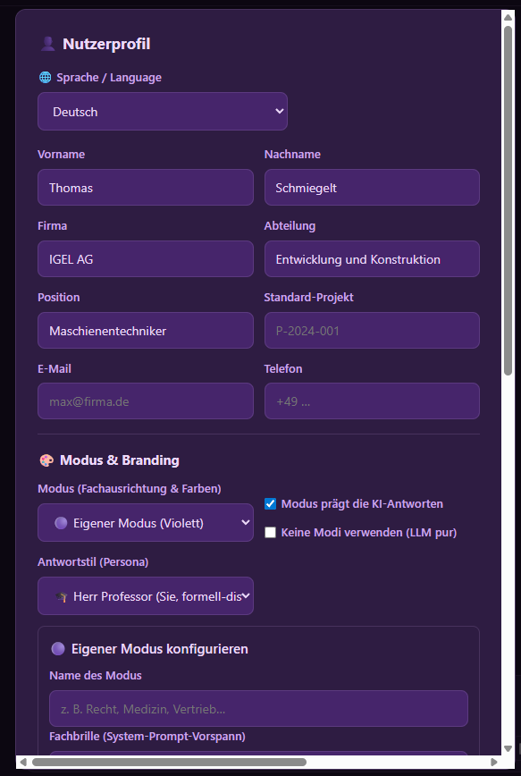
*👤 Profil — Modell-Rollen, Modus, Sprache und Branding.*

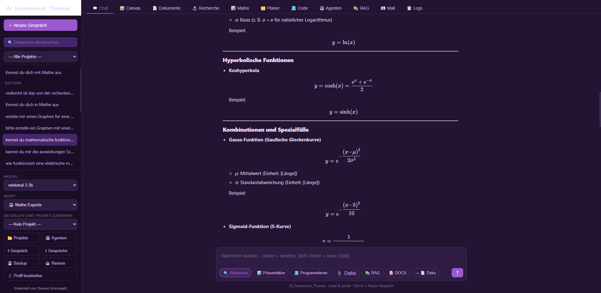
*💬 Chat mit Streaming, Tool-Aufrufen und Formel-/Plot-Ausgabe.*

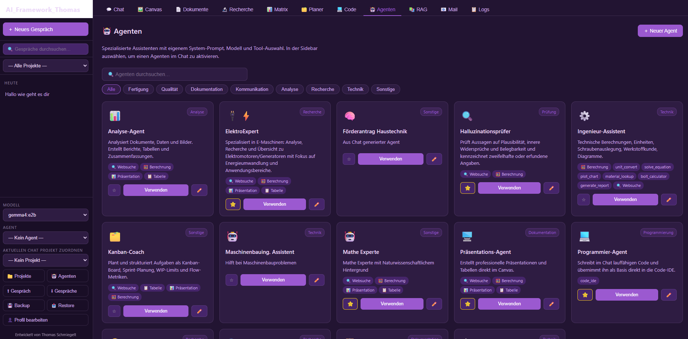
*🤖 Agenten — eigene System-Prompts und Tool-Sets, Favoriten in der Sidebar.*

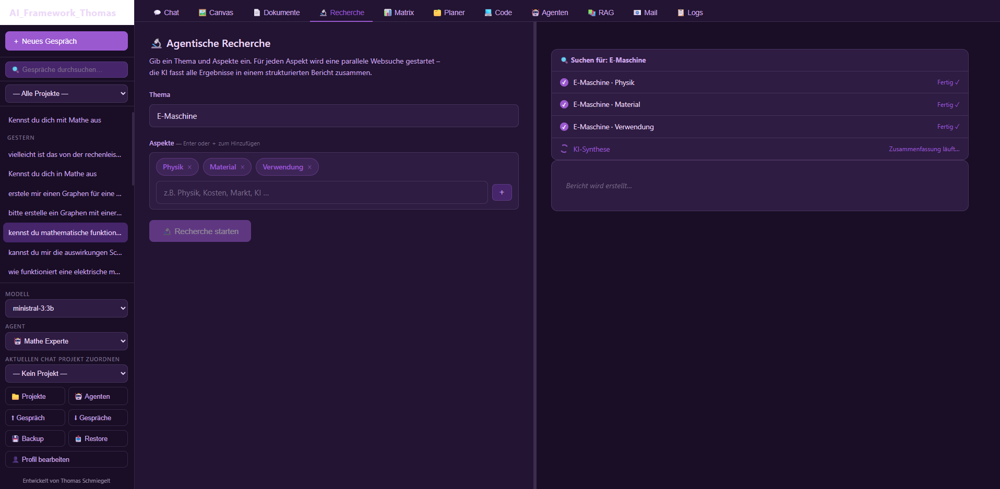
*🔬 Recherche — aspektbasiert mit Quellen.*

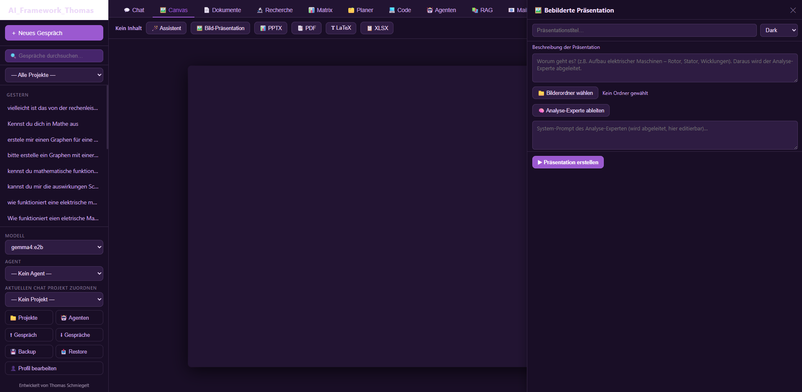
*🖼️ Canvas — Präsentationen & Tabellen mit WYSIWYG-Editor.*

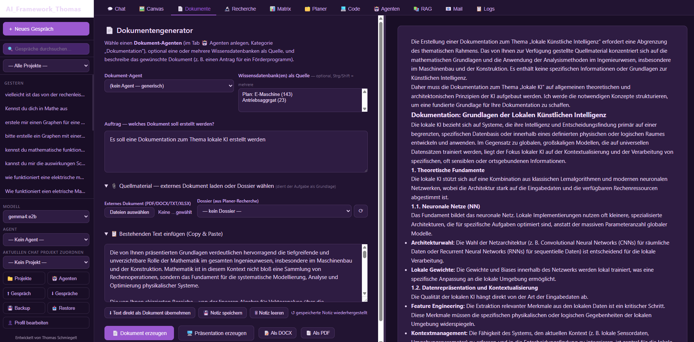
*📄 Dokumentengenerator — gestützt auf Agenten, Wissensdatenbanken und Quellmaterial.*

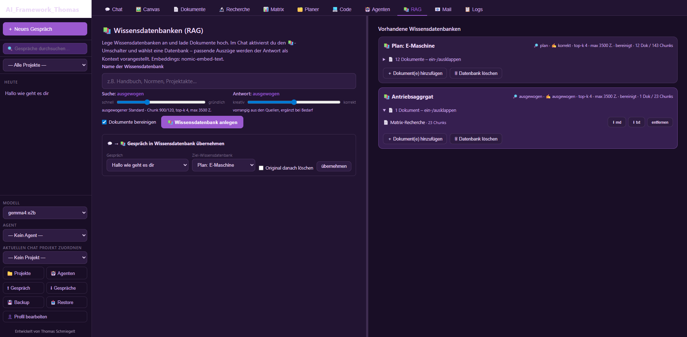
*📚 Wissensdatenbanken (RAG) — Dokumente einbetten und im Chat als Kontext nutzen.*

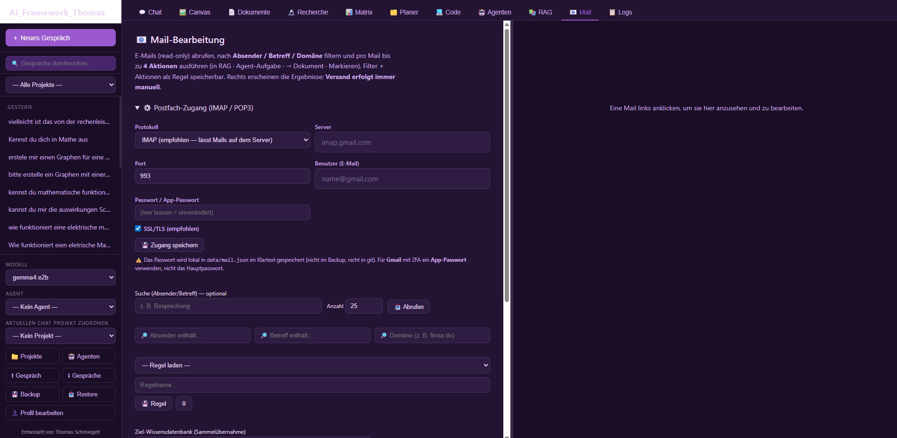
*📧 Mail-Bearbeitung (🚧 in Entwicklung) — Postfach read-only filtern und Aktionen auslösen.*

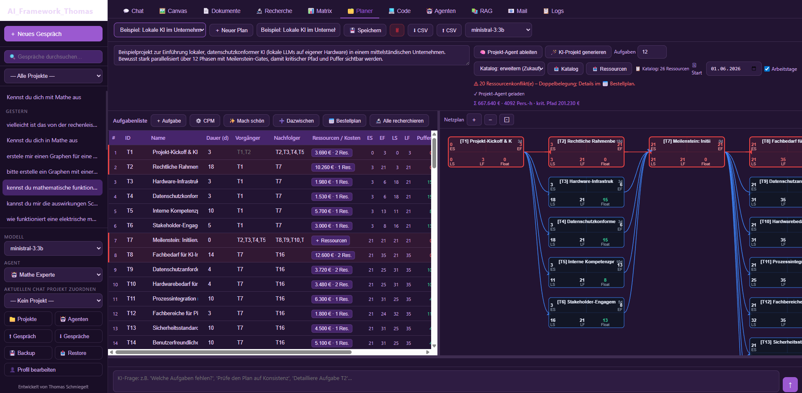
*🗂️ Planer — Netzplan / Kritischer Pfad (CPM) mit Ressourcen und Bestellplan.*

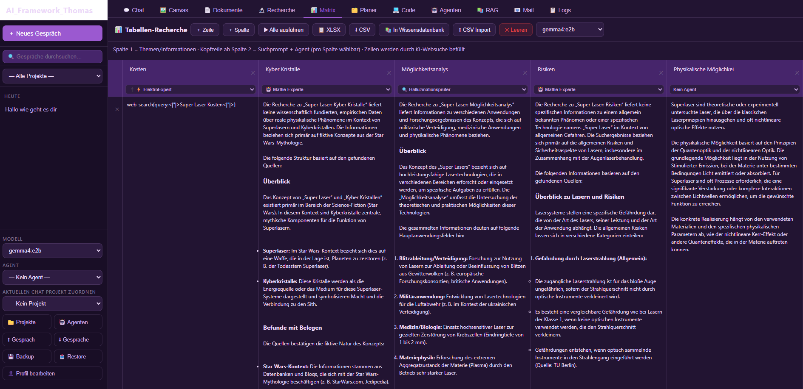
*📊 Matrix-Recherche — Recherche-Tabelle mit Agent je Spalte.*

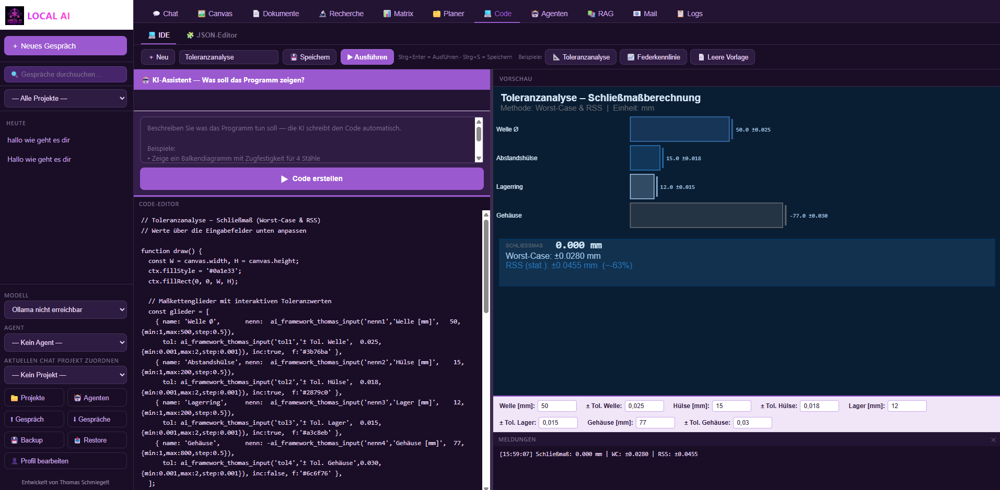
*💻 Code — IDE mit Canvas-Vorschau und JSON-Editor.*

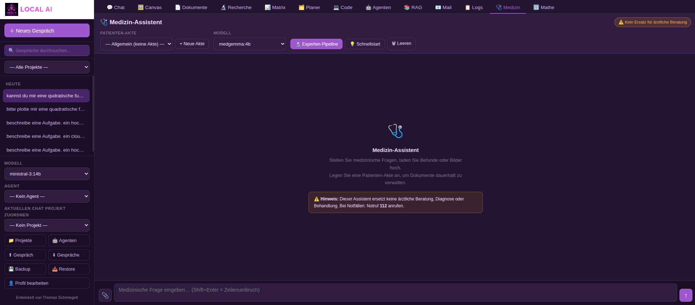
*🩺 Medizin — Zwei-Modell-Pipeline mit Rückfragen und Patienten-Akten.*

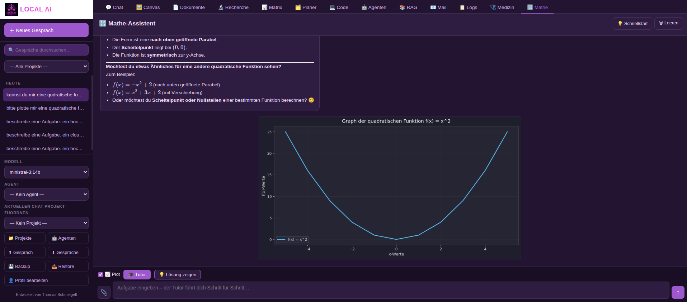
*🔢 Mathe — Workspace mit Plots, SymPy und Tutor-Modus (werkzeuggeprüft).*

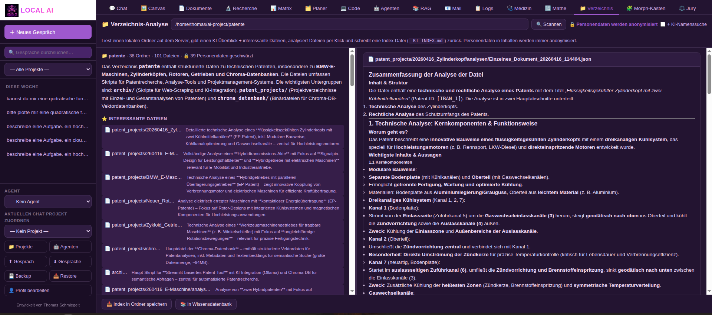
*📁 Verzeichnis-Analyse — Ordner serverseitig scannen, Dateien KI-analysieren (personenbezogene Daten werden anonymisiert), Index & Wissensdatenbank erzeugen.*

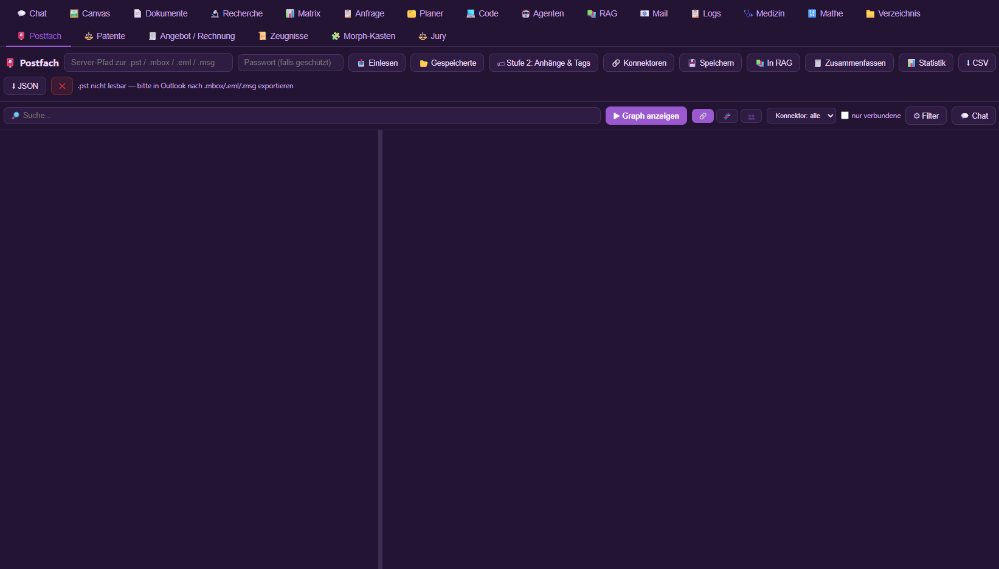
*📮 Postfach — PST-/Mail-Dateien lokal einlesen und als Wissensgraph auswerten (Konnektoren, Themen-Nähe, Kommunikationsnetz).*

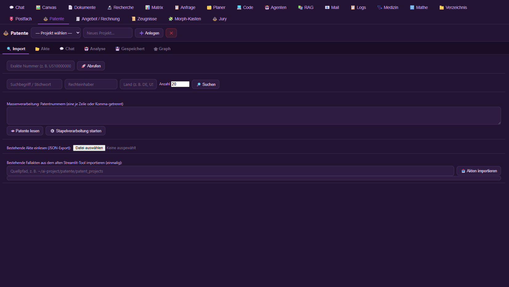
*⚖️ Patente — Patent-Recherche mit Fallakten, mehrstufiger KI-Analyse und Wissensgraph.*

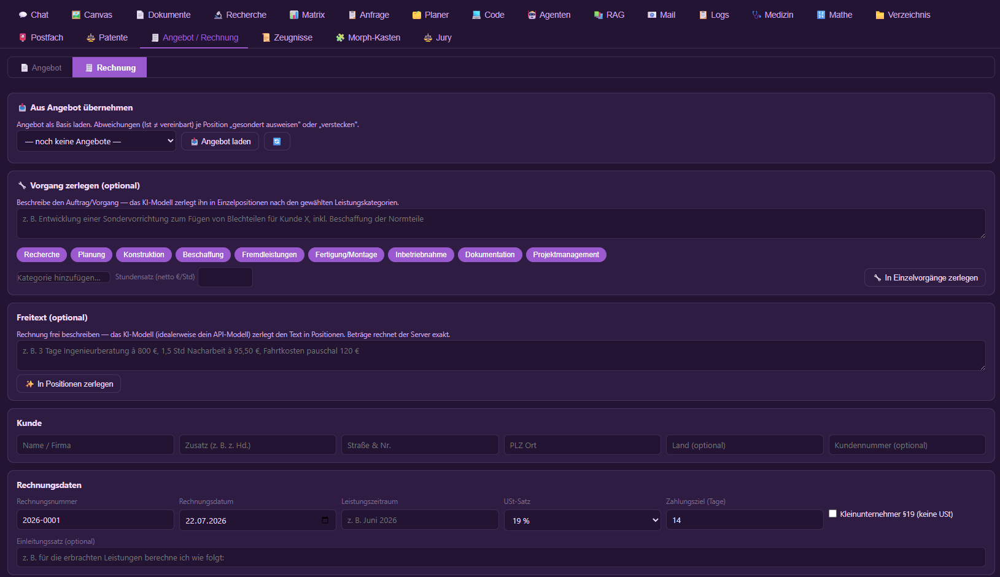
*🧾 Angebot / Rechnung — Positionen per KI zerlegen, Beträge rechnet der Server exakt (§14 UStG), Export als PDF/DOCX.*

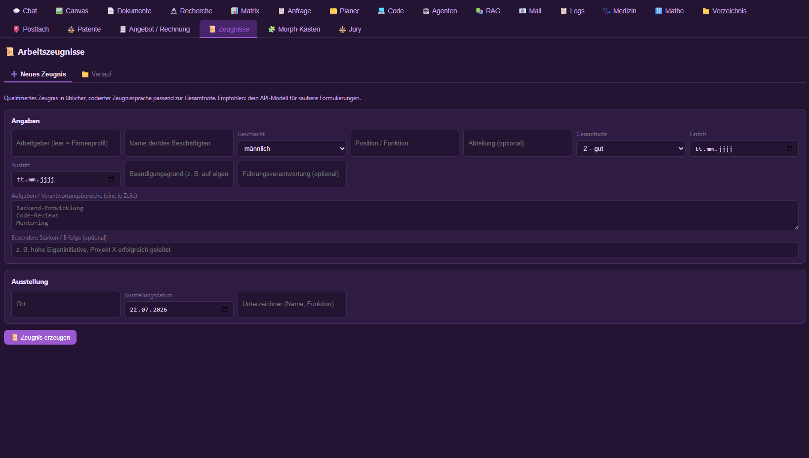
*📜 Arbeitszeugnisse — qualifizierte Zeugnisse in codierter Zeugnissprache passend zur Gesamtnote.*

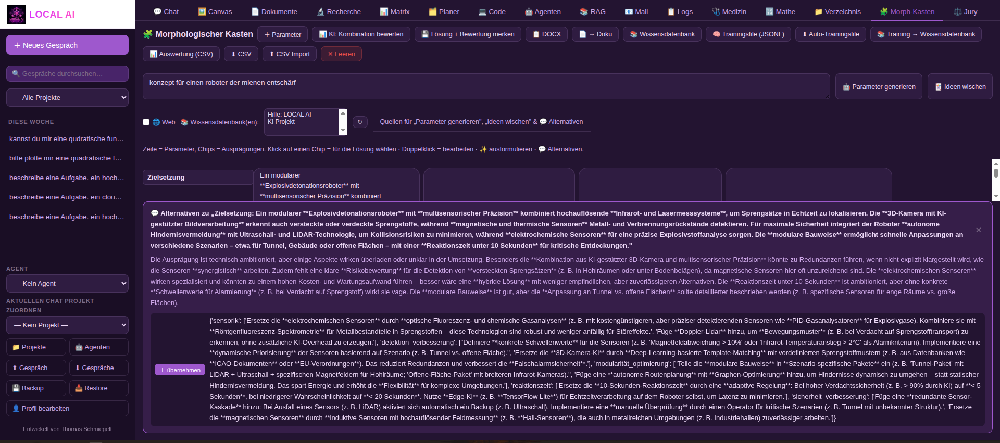
*🧩 Morphologischer Kasten — Ideenfindung über Parameter × Ausprägungen mit Bewertung, Schulnoten und Wischtechnik.*

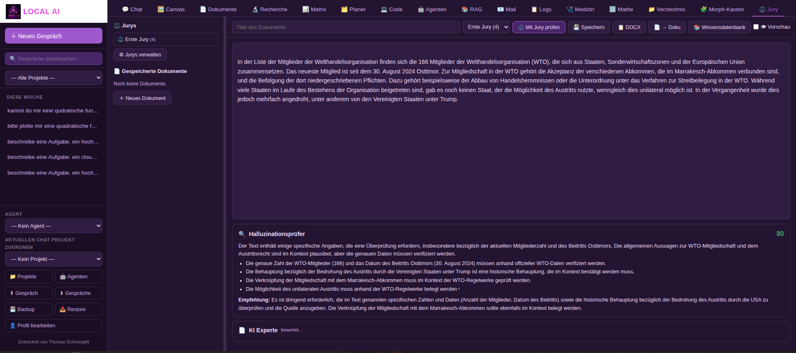
*⚖️ Jury — Mehr-Agenten-Bewertung eines Textes (z. B. Recht) mit Einzelurteilen und Gesamt-Synthese.*

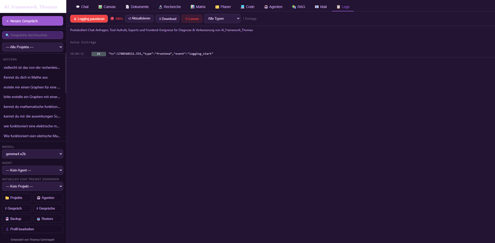
*📋 Diagnose-Logger — zuschaltbares Protokoll zur Fehlersuche.*

---

## Architektur

```
FastAPI (Python, async)  +  Vanilla JS (SPA)  +  Ollama (lokal)
        ↓                          ↓                   ↓
     main.py                  static/js/        localhost:11434
     tools/                   static/css/
     db.py (SQLite + FTS5)    data/profile_assets/ (Logo/Vorlagen)
```

Anwendungsfälle (was kann ich konkret tun?): **[USE_CASES.md](USE_CASES.md)**
Details für Entwickler: **[docs/ENTWICKLUNG.md](docs/ENTWICKLUNG.md)**
Bedienung für Anwender: **[BEDIENUNGSANLEITUNG.md](BEDIENUNGSANLEITUNG.md)**

---

## Konfiguration

`config.json` im Projektverzeichnis:

```json
{
  "allowed_models": [],
  "default_model":  "granite4.2:3b",
  "embed_model":    "nomic-embed-text",
  "ollama_base":    "http://localhost:11434",
  "port":           8780,
  "host":           "127.0.0.1",
  "enable_api":         true,
  "allow_python_exec":  true
}
```

> `allowed_models` ist nur noch eine **Sortier-Reihenfolge**, kein Filter: in den
> Modell-Auswahllisten (Profil) erscheinen **alle** in Ollama installierten Modelle.

**Optionale Installer-Schalter** (werden vom Installer gesetzt, lassen sich aber von Hand ändern):
- `enable_api` — externe OpenAI-kompatible KI-Anbieter (API) im Profil anbieten (Default `true`).
- `allow_python_exec` — **Python im 💻 Code-Tab serverseitig ausführen** (Default `true`).
  Lokal sinnvoll; im Mehrbenutzer-/Servermodus auf `false` setzen, da beliebiger
  Python-Code auf dem Server läuft. Bei `false` liefert der Endpunkt 403 und die
  Python-Option im Code-Tab wird ausgeblendet (`make_server` setzt den Wert auf `false`).

---

## Schnellstart (Linux)

Das Projekt läuft plattformneutral auch unter Linux. Voraussetzung: `python3`,
`python3-venv` und ein laufendes Ollama (`ollama serve`).

```bash
./install.sh             # venv + Pakete, optionale Tab-/API-Auswahl
./start.sh               # Start auf http://127.0.0.1:8780
```

Über Umgebungsvariablen steuerbar (siehe `start.sh`):

```bash
AI_HOST=0.0.0.0 AI_PORT=8780 ./start.sh        # im Netzwerk erreichbar
AI_SSL_CERT=certs/cert.pem AI_SSL_KEY=certs/key.pem ./start.sh   # HTTPS (PWA am Handy)
```

Oder direkt im Entwicklungsmodus mit Auto-Reload:

```bash
source venv/bin/activate
uvicorn main:app --host 127.0.0.1 --port 8780 --reload
```

---

## Verzeichnisstruktur

```
AI_Framework_Thomas/
├── main.py                 Backend (FastAPI, Agentic Loop, VRAM-Schutz)
├── db.py                   SQLite-Persistenz (+ FTS5)
├── config.json             Modell- und Server-Konfiguration
├── requirements.txt        Python-Abhängigkeiten
├── install / make_portable / make_server  (.bat + .ps1)  Installationsvarianten
├── start.bat / start_server.bat            Schnellstart
├── update.bat              Nur Systemdateien aktualisieren (Daten/config.json bleiben)
├── uninstall.bat / .ps1    Deinstallation
├── tools/                  search · files · export · engineering · materials · report · routing · imaging · rag · mail
├── static/
│   ├── index.html          Single-Page-App
│   ├── css/app.css         Theme + 7 Modus-Farbschemata
│   └── js/                 Frontend-Module (chat, canvas, ide, planner, …)
├── bilder/                 (leer – Branding kommt aus dem Nutzerprofil)
├── data/                   Laufzeitdaten (DB, agents, plans, code, uploads, …)
│   └── plans/              enthält ein 100-Aufgaben-Beispielprojekt
├── samples/                Beispiel-Ressourcenliste (CSV, importierbar)
├── scripts/                Hilfsskripte (Demo-Plan erzeugen, Release-ZIP bauen)
├── z-image/                Optionales lokales Bildmodell Z-Image-Turbo (eigene venv, eigener Installer)
└── docs/                   INSTALL · PORTABLE · SERVER · ENTWICKLUNG · …
```

## Lizenz

Dieses Projekt steht unter der **MIT-Lizenz** — siehe [LICENSE](LICENSE).

Die verwendeten Python- und Frontend-Bibliotheken stehen unter permissiven Lizenzen
(MIT, BSD, Apache-2.0, PSF); die vollständige Aufstellung mit Versionen findet sich in
[docs/LIZENZEN.md](docs/LIZENZEN.md). Die LLM-Modelle (z. B. `ministral-3:3b`) unterliegen
ihren eigenen, modellspezifischen Lizenzen — bitte auf der jeweiligen
[Ollama-Modellseite](https://ollama.com/library) verifizieren.

## Entwicklung & Credits

- **Entwickler:** Thomas Schmiegelt
- **Unterstützung:** Teile des Quellcodes und der Architektur wurden mit Unterstützung von **Claude Opus 4.8** (Anthropic) entwickelt.

## Rechtlicher Hinweis / Disclaimer

Dieses Projekt wurde nach bestem Wissen und Gewissen bezüglich der verwendeten
Lizenzen zusammengestellt. Sollten Sie dennoch eine Verletzung von Urheberrechten
oder Lizenzbedingungen feststellen, öffnen Sie bitte ein Issue oder kontaktieren
Sie mich direkt, damit die entsprechenden Teile umgehend angepasst oder
entfernt werden können.